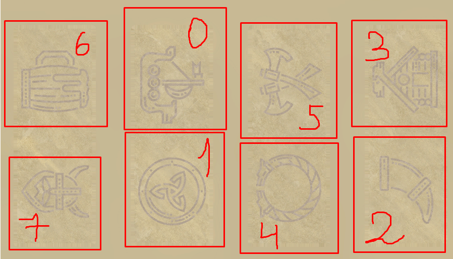

# BP\_ColumnLock

Inherited from _**BP\_Lock**_ and configured for vertical control. Icons used for _**SM\_ColumnSymbols**_ ([https://www.flaticon.com/packs/viking-9](https://www.flaticon.com/packs/viking-9))

The password on the column is configured in digits, the password is read from the bottom up. (If you look at the model)

