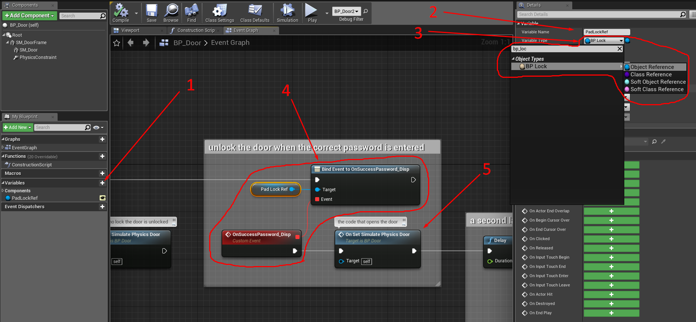

# How to open the door?

The pack contains a door that works with a lock, but I will tell you the main points needed to create your own door.

1. Create a variable
2. Call it for example “_**Padlock Ref**_”, make it “_**Instance Editable**_” for this you need to click on the eye to the right of the variable name
3. Set the type of the variable, in our case “_**BP\_Lock**_”
4. In **Begin Play**, subscribe to the Event “_**OnSuccessPassword\_Disp**_” (or you can subscribe elsewhere according to your logic)
5. And finally, the code that will open the door, in my case, I just turn on the physics.
