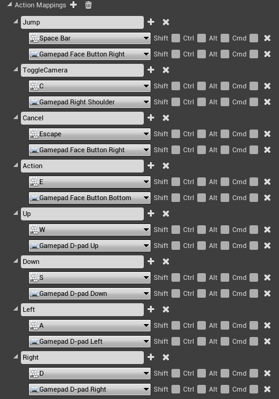
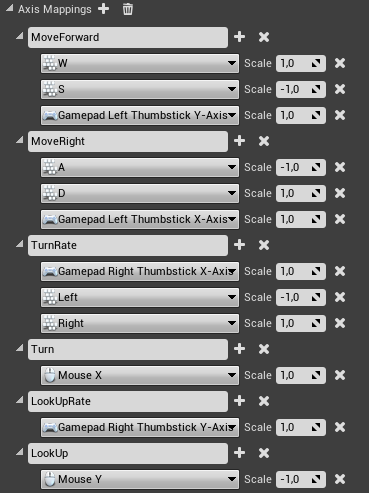
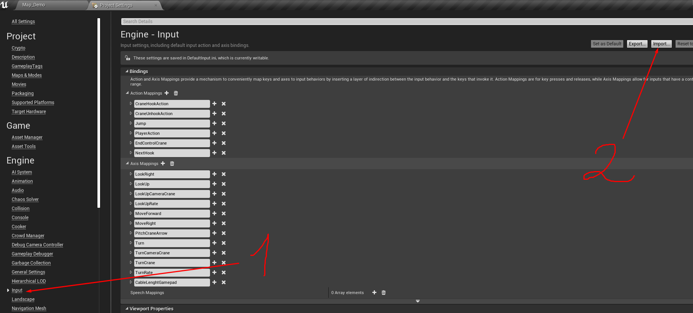

# Input

## **Manually configure control**

### **Action mappings**

In the project settings, create a control like in the image below.

### Axis mappings

## **Import file with control settings**


Importing a file with control settings will overwrite the existing control.


You can also download a [file](https://drive.google.com/open?id=1RX4HhJCN2W3D0L5JMGQl9B2nhoiTZhs2) with management settings and import it to **Project Settings -> Input -> Import**

